> 本文档 [`Frontmatter`](https://github.com/BTMuli/MuCli#Frontmatter) 由 [MuCli](https://github.com/BTMuli/Mucli) 自动生成于 `2024-04-11 12:06:15`
>
> 更新于 `2026-08-17 11:20:24`

> **项目目前处于开发阶段，不保证稳定性。**

    

# BangumiToday

基于 [Bangumi.tv](https://bangumi.tv)、[蜜柑计划](https://mikanani.hacgn.fun/) 的番剧应用。

结合本地目录，提供番剧更新提醒、SSR订阅&下载、进度记录等功能。

## 下载

> 程序已经通过微软商店审核，可以直接在商店下载。

## 使用前提

应用的良好使用体验**基于如下前提**：

1. 用户已经拥有 [Bangumi.tv](https://bangumi.tv) 账号，并且通过应用相关页面完成了登录授权。
2. 用户登录 Bangumi 账号后对收藏数据进行了同步。
3. 用户在特定条目页面设置了 `RSS` 订阅地址和下载目录。

## 应用预览

### 发现与管理番剧

按星期浏览 Bangumi 每日放送，快速查看开播时间、评分与收藏热度。

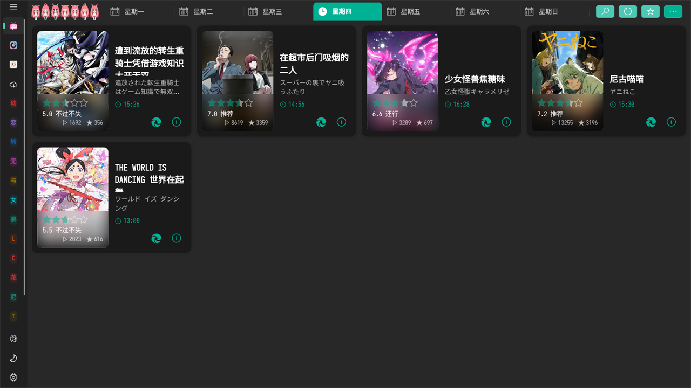

使用类型筛选和关键词查找条目，在双栏结果中直接比较评分、标签与基本信息。

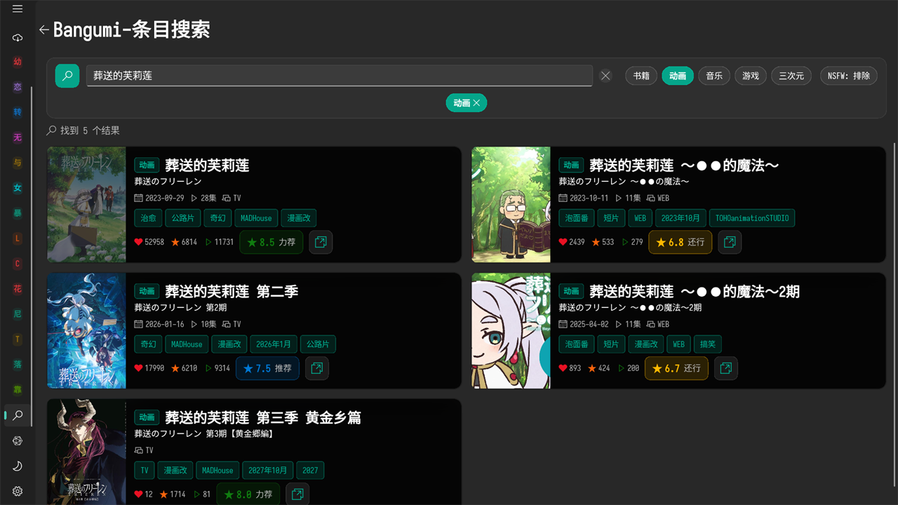

条目详情整合作品信息、评分分布、收藏状态、剧集进度与关联条目。

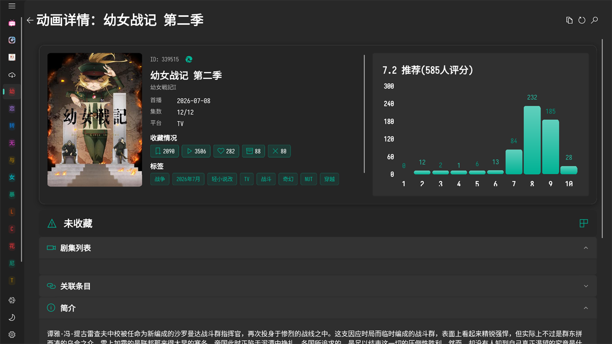

登录 Bangumi 后，可按收藏状态集中浏览自己的追番列表。

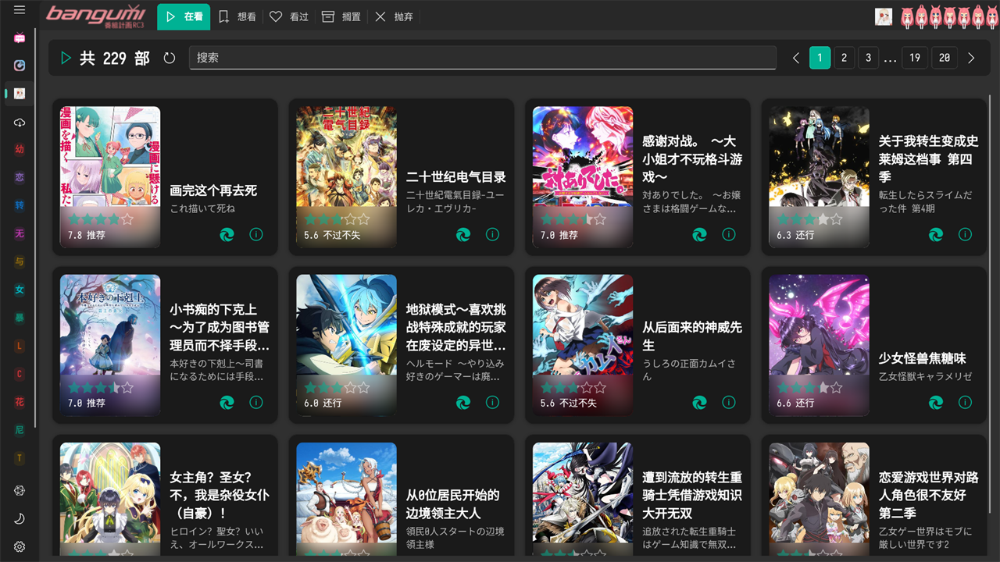

### 订阅与下载

BMF 工作台把番剧、RSS 订阅和本地目录组织成一个关联，可按更新状态、季度和关键词快速筛选。

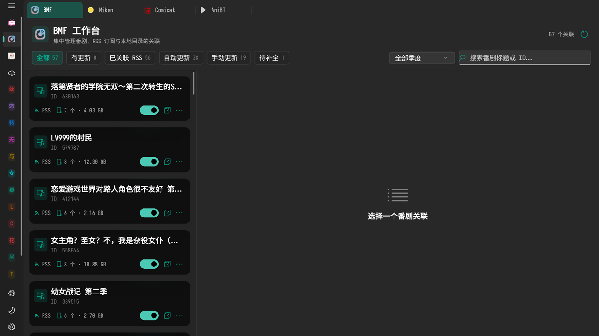

选中关联后，可并排查看订阅内容与本地文件，并直接编辑、刷新或打开对应位置。

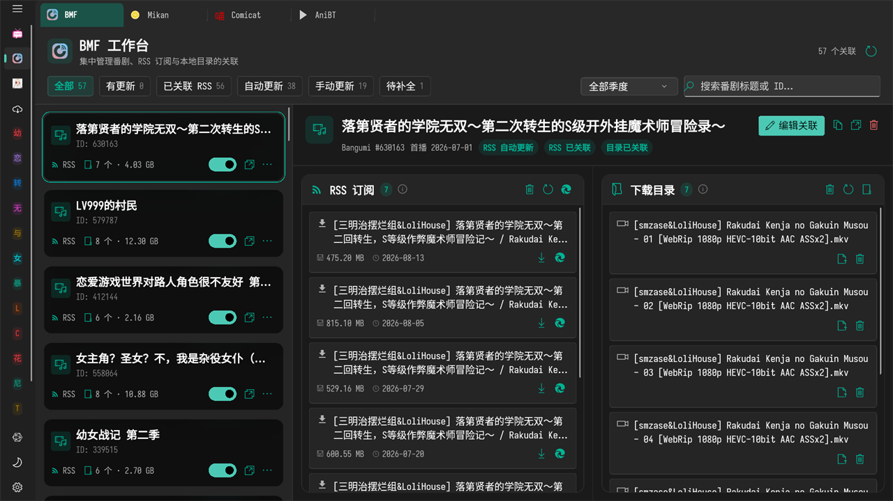

应用聚合 Mikan、Comicat 与 AniBT 的最新资源，可从列表直接下载种子或交给内置下载引擎。

<table>
  <tr>
    <td width="50%">
      <strong>Mikan</strong> 
      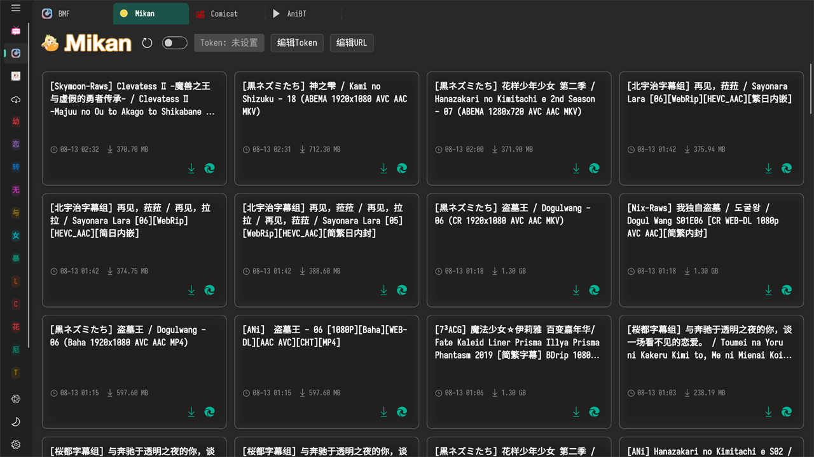
    </td>
    <td width="50%">
      <strong>Comicat</strong> 
      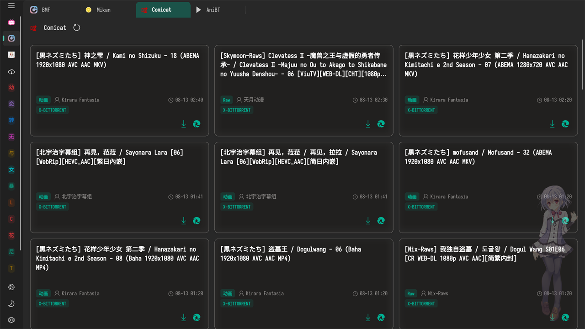
    </td>
  </tr>
  <tr>
    <td colspan="2">
      <strong>AniBT</strong> 
      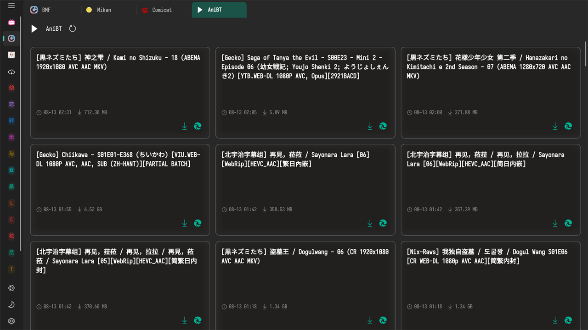
    </td>
  </tr>
</table>

下载管理页集中展示任务进度、速度、连接状态与做种信息，并提供暂停、设置和文件操作入口。

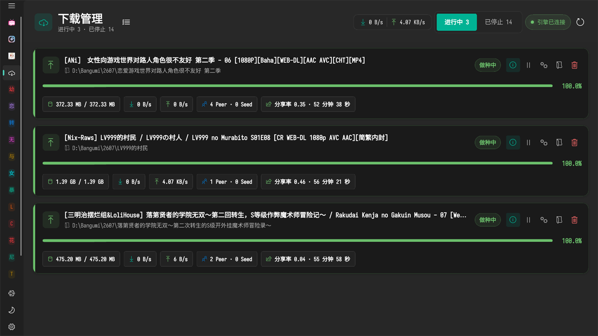

### 个性化与应用配置

在统一设置页中调整主题、缓存与目录，配置下载引擎、Tracker 以及 Bangumi 账号。

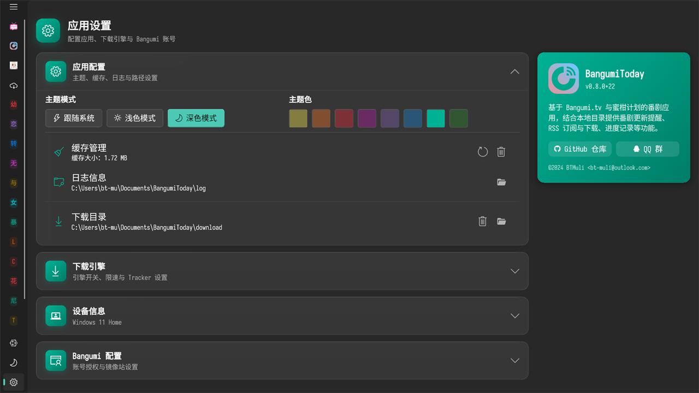

## 依赖（按照字典序）

项目使用了如下依赖以实现相关功能：

- [bt_download](https://github.com/BTMuli/bt_download)：提供内置 BitTorrent 下载能力。
- [FlChart](https://app.flchart.dev/)：用于绘制条目评分柱状图。
- [Fluent UI](https://bdlukaa.github.io/fluent_ui/)：用于实现 Fluent Design 风格的 UI。
- [Hive](https://github.com/isar/hive)：用于本地数据存储。

## 参考（按照字典序）

- [Ani](https://github.com/open-ani/ani)
- [BangumiAPI(doc)](https://bangumi.github.io/api/)
- [BangumiAPI(server)](https://github.com/bangumi/server)
- [BangumiOAuth](https://github.com/bangumi/api/blob/master/docs-raw/How-to-Auth.md)
- [czy0729/Bangumi](https://github.com/czy0729/Bangumi)
- [DandanPlay(doc)](https://github.com/kaedei/dandanplay-libraryindex/blob/master/api/OpenPlatform.md)
- [KNKPAnime](https://github.com/KNKPA/KNKPAnime)

## Special Thanks（按照字典序）

- [Bangumi.tv](https://bangumi.tv)
- [BangumiData](https://github.com/bangumi-data/bangumi-data)

## License

[MIT](./LICENSE)
