> 本文档 [`Frontmatter`](https://github.com/BTMuli/MuCli#Frontmatter) 由 [MuCli](https://github.com/BTMuli/Mucli) 自动生成于 `2024-04-11 12:06:15`
>
> 更新于 `2026-10-10 15:04:17`

> **项目目前处于开发阶段，不保证稳定性。**

    

# BangumiToday

基于 [Bangumi.tv](https://bangumi.tv) 的桌面番剧应用，聚合 [蜜柑计划](https://mikanani.me)、Comicat 与 [AniBT](https://anibt.net) 的 RSS 资源。

结合本地目录，提供放送日历、RSS 订阅与内置下载、进度记录、系统托盘等功能；内置下载引擎与系统代理目前仅在 Windows 可用。

## 下载

> 程序已经通过微软商店审核，可以直接在商店下载。

## 使用前提

应用的良好使用体验**基于如下前提**：

1. 用户已经拥有 [Bangumi.tv](https://bangumi.tv) 账号，并且通过应用相关页面完成了登录授权。
2. 用户登录 Bangumi 账号后对收藏数据进行了同步。
3. 用户在 BMF 工作台为番剧建立了关联，并配置了 RSS 订阅地址与本地目录。
4. 如需访问受限站点，可在设置中启用系统代理（仅 Windows）；下载引擎代理可单独开关。

## 应用预览

### 发现与管理番剧

按星期浏览 Bangumi 每日放送，快速查看开播时间、评分与收藏热度。

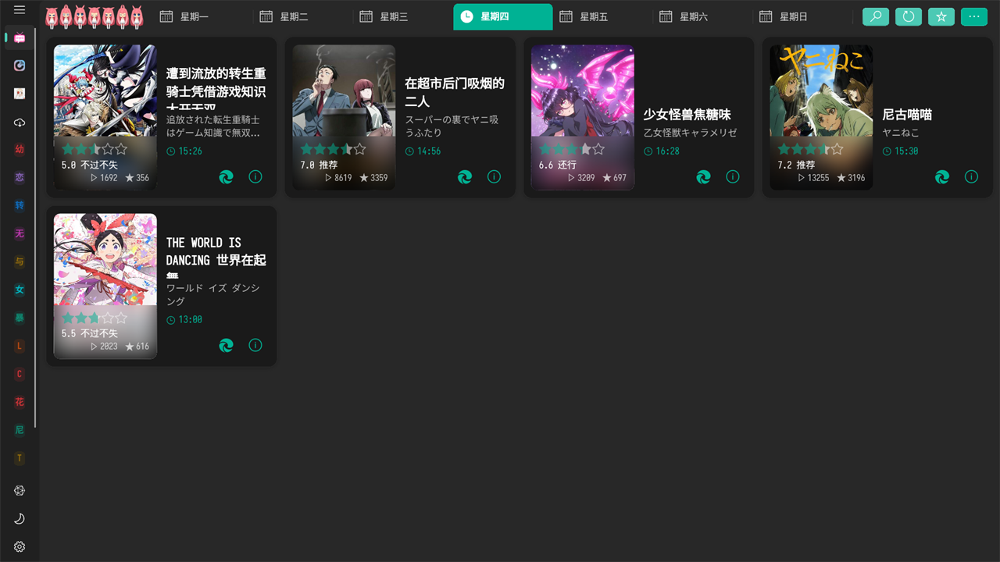

使用类型筛选和关键词查找条目，在双栏结果中直接比较评分、标签与基本信息。

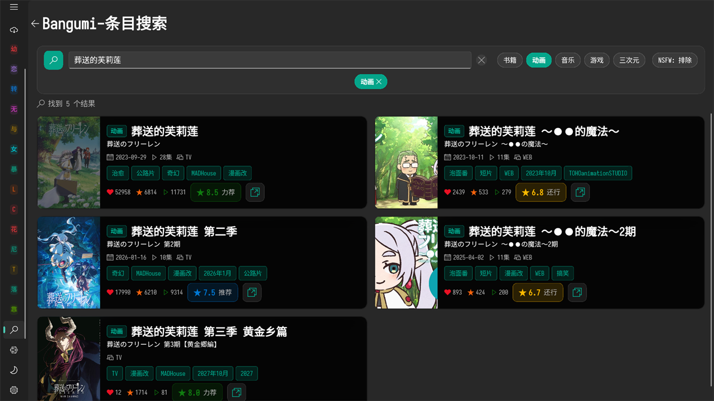

条目详情整合作品信息、评分分布、收藏状态、剧集进度与关联条目，默认使用更紧凑的新布局，也可切回原版。

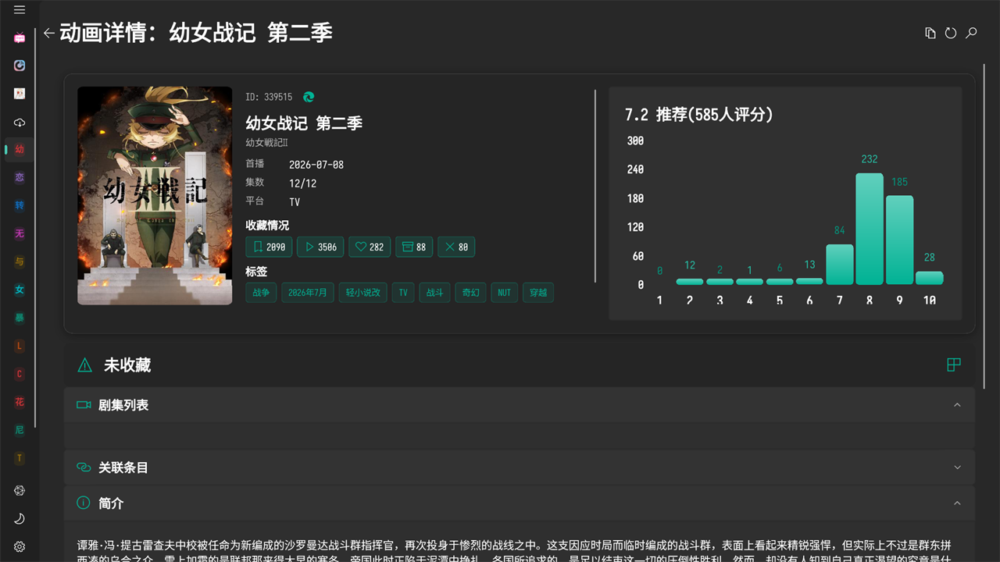

登录 Bangumi 后，可按收藏状态集中浏览自己的追番列表。

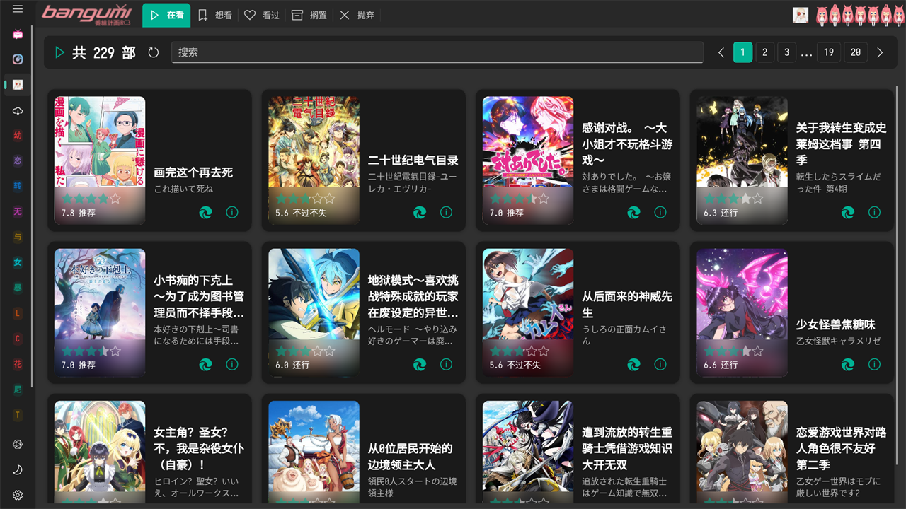

### 订阅与下载

BMF 工作台把番剧、RSS 订阅和本地目录组织成一个关联，可按更新状态、季度和关键词快速筛选。

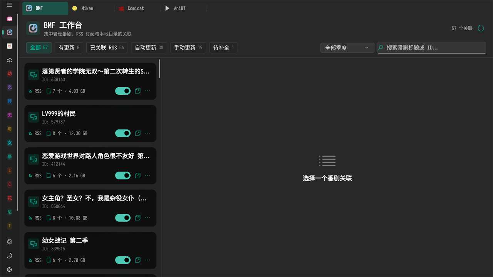

选中关联后，可并排查看订阅内容与本地文件，并直接编辑、刷新或打开对应位置。

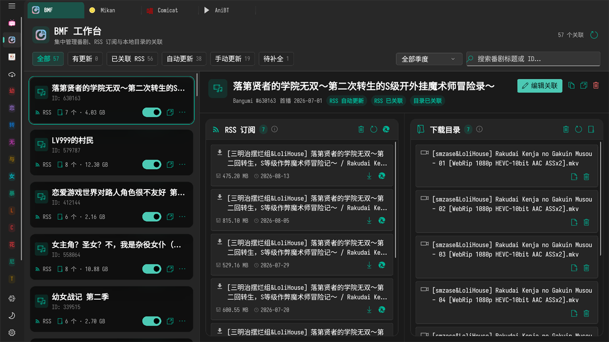

应用聚合 Mikan、Comicat 与 AniBT 的最新资源，可从列表下载种子文件或直接添加到内置下载引擎（Windows）。Mikan 默认使用 `mikanani.kas.pub`，也可切换官方站或自定义镜像。

<table>
  <tr>
    <td width="50%">
      <strong>Mikan</strong> 
      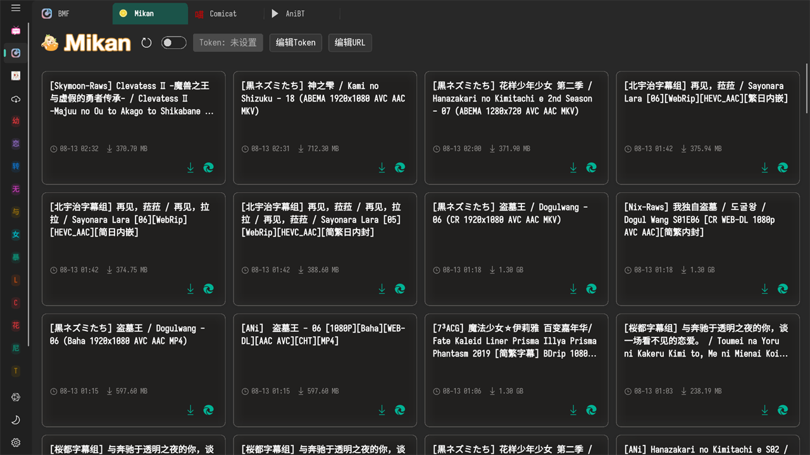
    </td>
    <td width="50%">
      <strong>Comicat</strong> 
      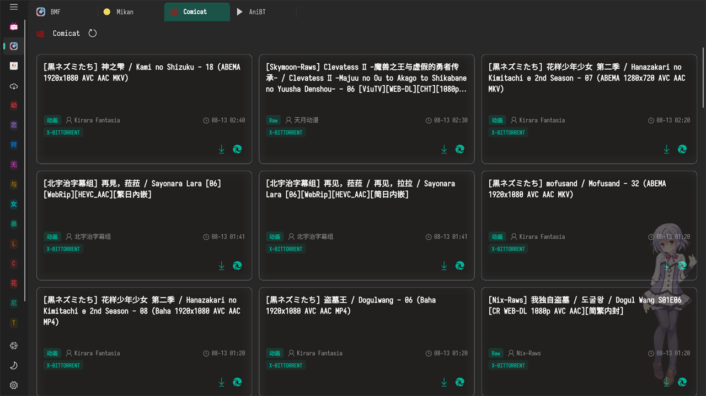
    </td>
  </tr>
  <tr>
    <td colspan="2">
      <strong>AniBT</strong> 
      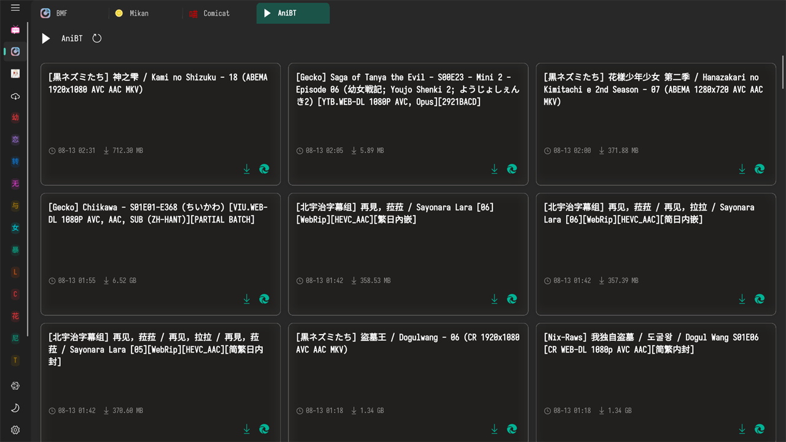
    </td>
  </tr>
</table>

Windows 下载管理页集中展示任务进度、速度、连接状态与做种信息，支持暂停、按文件选择、手动添加 HTTP / magnet / torrent，以及 Tracker 与限量做种。

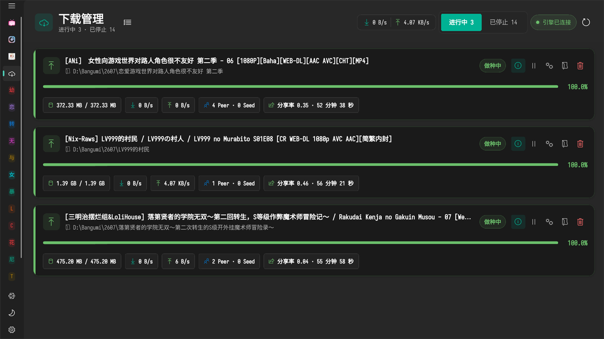

### 个性化与应用配置

Windows 内置播放器提供 Anime4K 轻量、标准和高质量超分，默认关闭，其中标准档为本项目自定义的中间组合，其余两档取自官方 Mode A。播放 1080p SDR 动画时，在 4K 播放区域选择“高质量”可请求 3840×2160 输出；信息窗显示请求/实际纹理尺寸。高质量使用较大的 CNN 模型，GPU 开销更高；小窗口按实际显示尺寸处理。

在统一设置页中调整主题、缓存与日志路径，配置下载引擎、Tracker、系统代理（以上三项仅 Windows），以及 Bangumi 账号与镜像站。

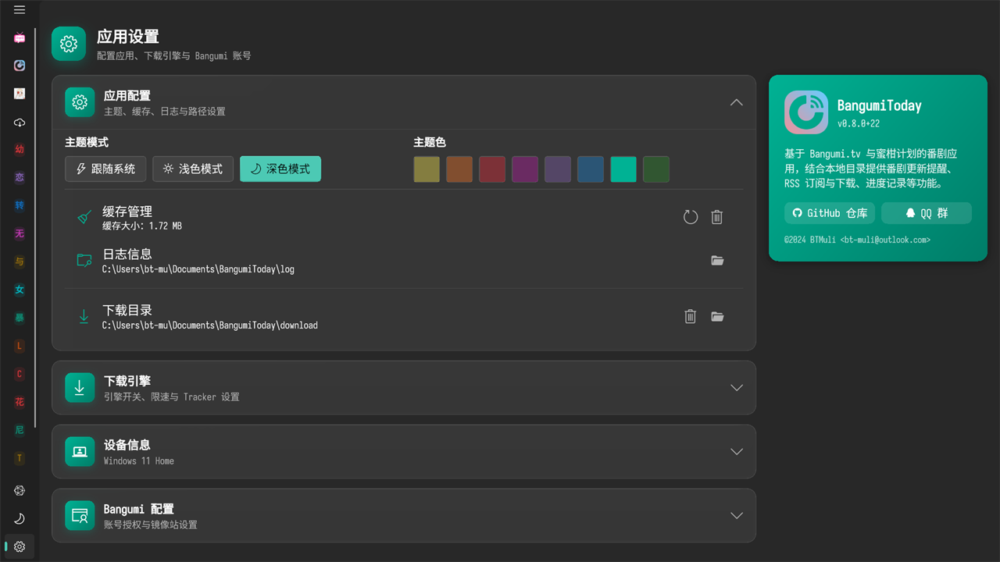

## 主要组件

具体 Dart 包版本以 [`pubspec.yaml`](./pubspec.yaml) 和 `pubspec.lock` 为准；
原生组件以子模块引用、CMake 固定值和推理锁文件为准。

| 组件 | 用途 |
| --- | --- |
| [Anime4K](https://github.com/bloc97/Anime4K) | GLSL 超分着色器 |
| [bt_download](https://github.com/BTMuli/bt_download) | 随 Windows 包提供的 BitTorrent / HTTP 下载引擎 |
| [Drift](https://drift.simonbinder.eu/) | SQLite 数据访问与迁移 |
| [FlChart](https://app.flchart.dev/) | 评分图表 |
| [Fluent UI](https://bdlukaa.github.io/fluent_ui/) | Fluent 风格桌面界面 |
| [Hive CE](https://github.com/IO-Design-Team/hive_ce) | 轻量本地状态 |
| [media_kit](https://github.com/media-kit/media-kit) | 播放器、字幕与视频插件 |
| [mpv-AnimeJaNai](https://github.com/the-database/mpv-AnimeJaNai) | Windows 固定 libmpv 分支及 AI 滤镜接入 |
| [Riverpod](https://riverpod.dev/) | 状态管理与依赖注入 |

## 参考（按照字典序）

- [Ani](https://github.com/open-ani/ani)
- [AniBT](https://anibt.net)
- [BangumiAPI(doc)](https://bangumi.github.io/api/)
- [BangumiAPI(server)](https://github.com/bangumi/server)
- [BangumiOAuth](https://github.com/bangumi/api/blob/master/docs-raw/How-to-Auth.md)
- [czy0729/Bangumi](https://github.com/czy0729/Bangumi)
- [KNKPAnime](https://github.com/KNKPA/KNKPAnime)

## Special Thanks（按照字典序）

- [Bangumi.tv](https://bangumi.tv)
- [BangumiData](https://github.com/bangumi-data/bangumi-data)

## 许可

- 项目自有源码采用 [MIT License](./LICENSE)，随包第三方组件保留各自的许可。
- 字体和 Anime4K 着色器的授权文本位于 [`assets/licenses/`](./assets/licenses/)。
- Windows libmpv 当前为 GPL 构建，来源、对应源码和许可见
  [libmpv NOTICE](./windows/licenses/libmpv/NOTICE.md)。
- 推理组件的第三方归属和许可见
  [THIRD_PARTY_NOTICES](./windows/playback/inference/THIRD_PARTY_NOTICES.txt)。
- 下载引擎及其依赖的许可、NOTICE 和 SBOM 随 `bt_download/` runtime 分发。
