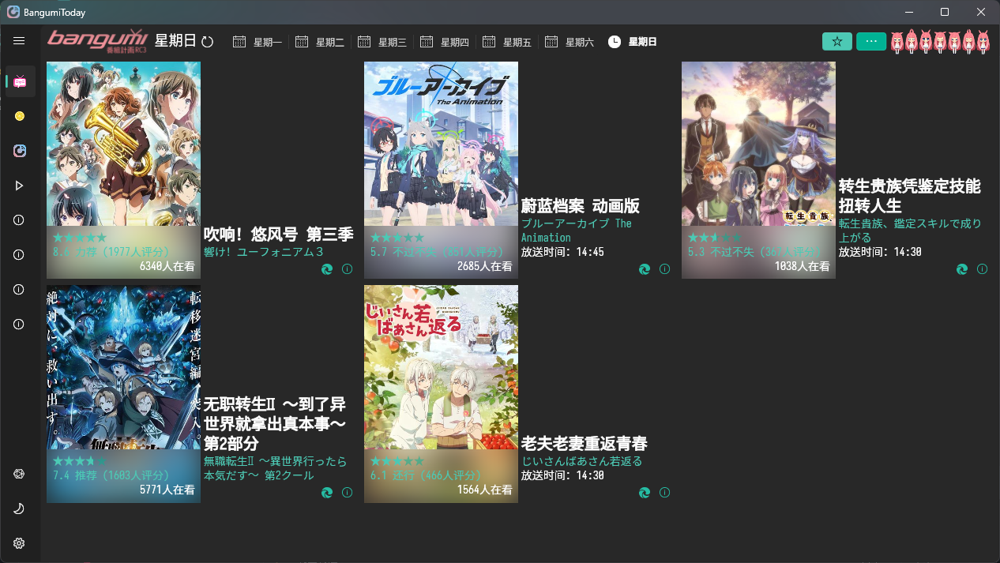
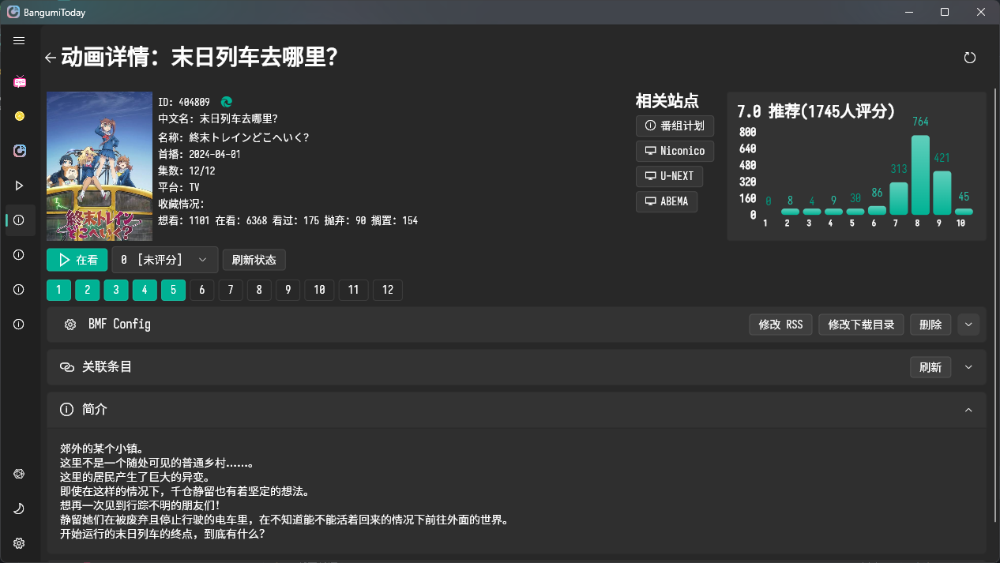
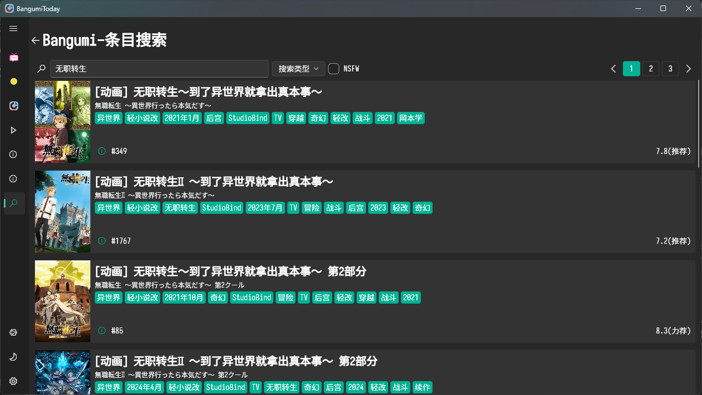
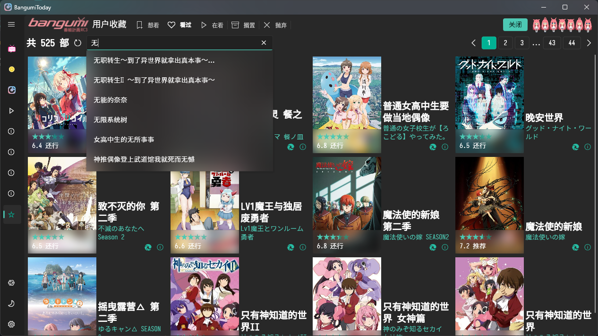

> 本文档 [`Frontmatter`](https://github.com/BTMuli/MuCli#Frontmatter) 由 [MuCli](https://github.com/BTMuli/Mucli) 自动生成于 `2024-04-11 12:06:15`
>
> 更新于 `2026-02-01 21:13:10`

> **项目目前处于开发阶段，不保证稳定性。**

    

# BangumiToday

基于 [Bangumi.tv](https://bangumi.tv)、[蜜柑计划](https://mikanani.hacgn.fun/) 的番剧应用。

结合本地目录，提供番剧更新提醒、SSR订阅&下载、进度记录等功能。

## 下载

> 程序已经通过微软商店审核，可以直接在商店下载。

## 使用前提

应用的良好使用体验**基于如下前提**：

1. 用户已经拥有 [Bangumi.tv](https://bangumi.tv) 账号，并且通过应用相关页面完成了登录授权。
2. 用户本地安装了 [Motrix](https://motrix.app/) 且将 `torrent` 默认关联到 Motrix。
3. 用户登录 Bangumi 账号后对收藏数据进行了同步。
4. 用户在特定条目页面设置了 `SSR` 订阅地址和下载目录。

## 应用预览

## 依赖（按照字典序）

项目使用了如下依赖以实现相关功能：

- [FlChart](https://app.flchart.dev/)：用于绘制条目评分柱状图。
- [Fluent UI](https://bdlukaa.github.io/fluent_ui/)：用于实现 Fluent Design 风格的 UI。
- [Hive](https://github.com/isar/hive)：用于本地数据存储。

## 参考（按照字典序）

- [Ani](https://github.com/open-ani/ani)
- [BangumiAPI(doc)](https://bangumi.github.io/api/)
- [BangumiAPI(server)](https://github.com/bangumi/server)
- [BangumiOAuth](https://github.com/bangumi/api/blob/master/docs-raw/How-to-Auth.md)
- [czy0729/Bangumi](https://github.com/czy0729/Bangumi)
- [DandanPlay(doc)](https://github.com/kaedei/dandanplay-libraryindex/blob/master/api/OpenPlatform.md)
- [KNKPAnime](https://github.com/KNKPA/KNKPAnime)

## Special Thanks（按照字典序）

- [Bangumi.tv](https://bangumi.tv)
- [BangumiData](https://github.com/bangumi-data/bangumi-data)

## License

[MIT](LICENSE)
