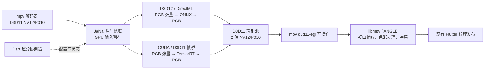

# AnimeJaNai ONNX 接入方案

核对日期：2026-10-08。状态：DirectML 帧桥、基础包和应用两档 AI 控制已接入；
隔离原生验证已有证据，真实播放与发布环境仍待验收，P0 未通过。TensorRT 和
选装资源服务尚未实施，当前进度见第 14 节。

本方案面向 BangumiToday 的 Windows x64 内置播放器，采用
AnimeJaNai HD V3.1 Standard ONNX 模型和 mpv 原生视频滤镜。
主安装包自带两个模型、DirectML 和项目推理桥。TensorRT 为用户主动启用的
可选加速：应用识别实际播放显卡的 CUDA compute capability，只下载固定版本
公共运行库和对应架构构建资源，校验后在本机生成引擎。用户无需安装开发 SDK。

交付目标是默认使用 DirectML；NVIDIA 用户启用并准备好可选组件后优先
TensorRT，TensorRT 路径不可用时尝试 DirectML。两条路径均通过 D3D11 / ANGLE 将结果
交给现有 Flutter 纹理播放器。实施先验证 DirectML，再完成 CUDA / D3D11
推理桥；两条路径、选装下载和准备完成后的离线使用验收均属于本次方案的完成条件。

这里的 DirectML 是 ONNX Runtime 的 GPU Execution Provider；模型文件仍是
ONNX。本方案选择的是播放链路上的接入方式，而不是在 Dart 层逐帧调用
一个 ONNX 插件。

现有 DML 帧桥采用 D3D11 转换着色器、D3D12 张量和共享 R16_FLOAT 纹理，
跨 API 不共享 buffer；细节见原生实现说明。下文保留完整交付目标和未来设计，
已实施范围以第 14 节为准。

## 1. 范围与交付行为

首期交付：

- 在现有视频超分选项中增加 `AnimeJaNai · 流畅` 与
  `AnimeJaNai · 高质量`，分别对应 Performance、Balanced。
- 支持需要放大的高清 SDR 二维动画，典型输入为 720p、1080p，模型放大
  2 倍，再由 mpv 按实际播放器视口缩放。
- 支持 DirectML 可用、D3D11 / ANGLE 互操作通过验证的 NVIDIA、AMD、Intel
  显卡；NVIDIA 用户主动启用 TensorRT、组件齐全且满足固定版本的 GPU、
  驱动和互操作要求时优先 TRT。硬件支持与实时播放能力分开判断。
- 继续提供现有 Anime4K 选项。已有用户的超分设置按原来的含义读取。
- TensorRT 能力检测、引擎构建或加载失败时，在资源和设备允许的情况下
  尝试 DirectML；两者均不可用时恢复普通播放。活动推理失败、显存不足或
  持续超出帧预算时先恢复普通播放，不在故障热路径上反复切换后端。
- Windows x64 主包提供 DML、两个模型及轻量原生桥；未启用 TensorRT 的
  用户不下载 NVIDIA 组件。选装时只下载公共运行库和实际显卡所需的架构包，
  不下载全部 GPU 构建资源。
- TensorRT 下载与首次引擎构建有独立状态、大小提示、取消与重试。准备期间
  保持普通播放或仍有效的 DML；未选择 JaNai 的用户不触发模型准备或下载。
- 用户只需兼容的 Windows、显卡和驱动，无需安装 Python、VapourSynth、
  CUDA Toolkit、TensorRT SDK 或 ONNX Runtime。NVIDIA 驱动属于系统前提，
  不随应用安装或替换。
- DML 首次使用可离线。TensorRT 首次选装需要网络；组件与引擎准备完成后
  可离线使用，清理引擎缓存后可用已安装组件离线重建。

首期边界：Windows x64；SDR、BT.709、4:2:0；输出不超过 3840×2160 的
像素预算。HDR、SD 模型、任意模型导入、多模型串联、RIFE、4:4:4 输出与
macOS 接入属于后续工作。偏离已验证的色彩、格式或尺寸契约时保留普通播放。

## 2. 已核实的项目现状

| 位置 | 当前行为 | 对接入的影响 |
|---|---|---|
| `lib/store/playback_store.dart` | 创建 media_kit Player；Windows 固定 `d3d11va-copy`；管理超分偏好、媒体切换与销毁 | JaNai 需要 GPU 帧，启用时要协调解码方式和滤镜生命周期 |
| `lib/models/playback/playback_upscale.dart` | `off/light/standard/high`；根据输入与视口计算输出；限制 SDR、软件渲染器和输出预算 | 可复用准入判断，但模型输入尺寸与最终纹理尺寸必须分开 |
| `lib/core/services/playback_upscaler.dart` | 合并布局事件、generation 失效、配置串行化、恢复与输出确认 | 保留协调器职责，拆出 Anime4K 和 JaNai 两种实现策略 |
| `native_playback_upscale_backend.dart` | 设置 `glsl-shaders`、`VideoController.setSize` | ONNX 应增加视频滤镜控制，不通过 GLSL 属性加载 |
| `playback_assets.dart` | 固定 Anime4K 资源清单与 SHA-256 校验 | 采用同类固定清单校验模型与推理运行库 |
| `windows/playback/video_output.*` | libmpv Render API 向 OpenGL FBO 渲染，随后发布 Flutter 纹理 | 继续使用当前帧调度和纹理发布方式 |
| `windows/playback/angle_surface_manager.*` | D3D11 上的 ANGLE，创建 OpenGL ES 2 上下文 | 能否接收滤镜的 D3D11 视频纹理必须先验证 |
| `windows/cmake/playback_runtime.cmake` | 固定 JaNai libmpv（现为 AnimeJaNai GPL 构建 `2026-10-07-d6d93599d5`）及 DLL / SDK 哈希 | 发布前可按同一工作流产出 LGPL 包后替换四个常量 |
| `windows/cmake/playback_inference.cmake`（新增） | 编译并安装垫片为 `aji.dll`、安装固定推理基础包、生成 `animejanai.conf` | 已接通，基础包缺失时 configure 失败 |
| `windows/cmake/playback_renderer.cmake` | 固定 media_kit_video 2.0.1 的源文件覆盖 | 原生修改继续落在仓库，使用同一套头文件与 ABI |
| `windows/playback/inference/*` | 独立原生 DML 张量会话与 GPU 帧桥（未链接进应用） | 已按 CPU 参考验证帧级契约；仍需 mpv / ANGLE / Flutter 接入后才算生效 |
| `PlaybackDiagnostics` / 原生日志 | 已记录解码、掉帧、输出纹理与各渲染阶段耗时 | 增加模型与推理数据，判断整条播放链路是否实时 |

当前 `videoParams` 事件直接驱动超分输入判断。加入视频滤镜后，必须分别读取
解码前的原始参数和滤镜后的输出参数，防止把已经放大的尺寸再次当成模型输入。

## 3. 模型与依赖固定方式

### 3.1 首期模型

采用 Standard，Sharp 版本后续作为独立选项评估。来源固定到
`the-database/mpv-AnimeJaNai` 的
`7f502d171ab5dd1f78685cb331047e5a7446635d`，目录为
`BuildMpvUpscale2xAnimeJaNai/mpv-upscale-2x_animejanai/animejanai/onnx/`。

| 档位 | 文件 | 大小（字节） | SHA-256 |
|---|---|---:|---|
| 流畅 | `2x_AnimeJaNai_HD_V3.1_Performance_SPANF3_b5f48_unshuffle_fp16.onnx` | 740318 | `7b804d87320f37b7269d6e27796046fbd975e95e2aa1f65d5557f52a36282716` |
| 高质量 | `2x_AnimeJaNai_HD_V3.1_Balanced_SPANF3_b8f64_unshuffle_fp16.onnx` | 1971970 | `b308e93c3dda3c4f9f968295b2b7b8d1c0583a711bca53a08d51134d9d1cbd5c` |

上述大小和哈希已按固定提交中的完整 ONNX 文件计算。官方对 V3.1 的说明是
Performance 接近旧 SuperUltraCompact 的速度、Balanced 接近旧 UltraCompact
的速度，画质分别有所提升；这属于作者的描述，不作为本项目的性能验收结果。
[模型发布说明](https://github.com/the-database/mpv-AnimeJaNai/releases/tag/3.3.0)

模型校验除了文件哈希，还需在准备阶段读取实际图信息：输入 / 输出名称、
element type、NCHW 布局、batch=1、动态 H/W、opset、尺寸整除及 padding
约束、2 倍输出关系。文件名中的 `fp16` 不能代替图契约验证；支持范围由两份
实际模型与所固定的后端共同决定。

### 3.2 原生实现基线

优先复用上游的 mpv `vf_animejanai` 和 `animejanai-inference`，先验证其
DirectML 路径，再为 TensorRT 补齐本项目需要的 D3D11 帧桥。基础库随应用
分发，NVIDIA 组件从项目固定发行源选装，不从用户系统里的 SDK 查找依赖。

| 组件 | 调研基线 | 交付时的要求 |
|---|---|---|
| mpv JaNai 滤镜 | `the-database/mpv`，提交 `d6d93599d59069b715013a6e77e898056499b905` | 由固定源码构建包含滤镜、D3D11 EGL 互操作和现有音频功能的 LGPL libmpv；同步 SDK / 导入库 / DLL |
| aji 推理桥 | `the-database/animejanai-inference`，`v0.9.0`，提交 `c7f56baf966064a7855db2f82a2f1b0d0c6cfdb3` | 该版本是 ABI v8；提供 loader、DML 与 TRT 部分，记录项目帧桥补丁 |
| ONNX Runtime DirectML | 上游打包脚本使用 `Microsoft.ML.OnnxRuntime.DirectML` 1.24.4 | 固定 NuGet 文件哈希与原生 x64 文件，核实两模型算子及 FP16 支持 |
| DirectML | 上游打包脚本使用 `Microsoft.AI.DirectML` 1.15.4 | 固定对应运行库与许可，和所选 ORT 版本一起验证 |
| TensorRT | 上游打包脚本使用 11.3.0.99、CUDA 13.4 变体 | 从 NVIDIA 固定来源取得可分发组件；aji TRT 桥、运行库、parser、trtexec 与构建资源使用同一套版本 |
| CUDA Runtime | 上游打包脚本使用 13.4.49，Windows 文件为 `cudart64_13.dll` | 使用 NVIDIA redistributable 来源并固定哈希；根据 DLL 依赖审计补齐其他必要的可分发文件 |
| ANGLE | 当前 media_kit_video 随附版本 | 首期沿用，P0 确认实际 EGL 扩展、NV12 / P010 输入和适配器一致性 |

这些是研究基线，不是已经通过 BangumiToday 验证的兼容组合。发布清单必须
固定完整提交、构建选项、二进制哈希和依赖清单，不从移动的 `main/master`
或“最新发布”下载运行库。上游 README 部分内容仍描述早期状态，接口以
上述固定版本的 `aji.h`、滤镜源码和打包脚本为准。
[原生滤镜](https://github.com/the-database/mpv/blob/d6d93599d59069b715013a6e77e898056499b905/video/filter/vf_animejanai.c)、
[aji ABI](https://github.com/the-database/animejanai-inference/blob/v0.9.0/include/aji.h)

### 3.3 主包、选装组件与系统前提

下表是组件分发与职责清单；最终文件名、数量和逐文件 SHA-256 由固定版本
产物生成，不把通配符直接当作发布清单。

| 组件 | 内容与分发方式 | 用途 |
|---|---|---|
| 原生桥 | 主包：`aji.dll`、`aji_dml.dll`、`aji_trt.dll` 与项目补丁产物 | TRT 桥只在选装资源就绪后加载，缺少 NVIDIA DLL 不影响 DML |
| DirectML | 主包：`onnxruntime.dll`、`DirectML.dll` 及依赖审计确认的文件 | 三家 GPU 的默认推理与 NVIDIA 的备用路径 |
| C++ Runtime | 主包：`msvcp140.dll`、`msvcp140_1.dll`、`vcruntime140.dll`、`vcruntime140_1.dll`，来自固定公开 VC_redist 14.51.36231.0 并逐个哈希校验 | 不额外要求用户安装 VC++ 运行库或修复 DLL |
| TensorRT 公共组件 | 选装 `trt-runtime`：`nvinfer_11.dll`、需要的 plugin、`nvonnxparser_11.dll`、`trtexec.exe` | 本机引擎构建和执行，各支持架构共用 |
| CUDA Runtime | 纳入选装 `trt-runtime`：`cudart64_13.dll` 及实际需要的可分发依赖 | TensorRT / CUDA 帧桥所需的用户态运行库 |
| GPU 构建资源 | 选装 `trt-smXX`：实际 GPU 匹配的 `nvinfer_builder_resource_smXX_11.dll` | 首次使用从 ONNX 构建引擎，不下载其他架构资源 |
| PTX 构建资源 | 可选 `trt-ptx`，只对清单中已验证的设备路径使用 | 经过验证的替代路径，不与匹配 SM 包默认一同下载 |
| 模型与声明 | 主包：两份 Standard ONNX、可信资源清单和基础许可；选装包带自己的许可与来源 | 校验、准备及离线使用 |

文件与版本基线来自固定提交的
[上游打包脚本](https://github.com/the-database/mpv-AnimeJaNai/blob/7f502d171ab5dd1f78685cb331047e5a7446635d/BuildMpvUpscale2xAnimeJaNai/Program.cs)。
交付前以本项目实际导入、延迟加载和干净机器验证结果闭合每组依赖，不能仅复制
上述主要 DLL 就宣称运行包完整。

本方案在用户设备上构建引擎，因此采用包含构建能力的 TensorRT 组件。
只提供 Lean / Dispatch 执行运行库无法覆盖首次 ONNX 转换；完整开发包中的
头文件、导入库、Python 包、示例和编译器不进入最终安装包。
[TensorRT 运行库选型](https://docs.nvidia.com/deeplearning/tensorrt/latest/installing-tensorrt/installing.html)

系统提供 Windows 图形组件与显卡驱动；不分发 `nvcuda.dll` 或驱动安装程序。
最低 Windows 版本、NVIDIA 驱动版本和 GPU compute capability 按最终固定
TRT / CUDA / ORT 组合的官方支持矩阵写入清单，并通过真实设备验证。
检测不到所需驱动或 GPU 超出支持清单时尝试 DML；两者均不满足时保留普通
播放，不要求用户安装完整 Toolkit 来修复不支持的硬件。
[TensorRT 支持矩阵](https://docs.nvidia.com/deeplearning/tensorrt/latest/getting-started/support-matrix.html)

## 4. 帧处理架构



模型处理原始视频内容；字幕、OSD 和 Flutter 控件在之后合成。最终视口尺寸
由现有播放器决定，模型不随着每一次窗口拖动改变输入形状。

图中的 TensorRT 帧桥是需要新增并验证的实现，尚未接通；安装运行库本身
不能补齐 GPU 互操作。具体路径和引擎准备见第 9 节。

DirectML 使用 D3D12。上游滤镜通过可共享的 D3D11 输入 / 输出纹理连接它，
存在 GPU 内部复制和同步；目标是避免逐帧 CPU 像素回读，不宣称没有复制。
DML 输出目前按 NV12/P010 回到 4:2:0，不能声称保留了模型的全部 4:4:4 色度。

mpv 的 `hwdec_d3d11egl.c` 提供 NV12/P010 到 ANGLE 的映射，还会取得 ANGLE
实际使用的 D3D11 device。它需要 EGLStream、D3D texture producer、device
query、外部纹理和纹理通道等能力。2026-10-08 已用随包 ANGLE 按同一流程验证
通过（见原生实现说明）：输出纹理可被当前 ANGLE 采样，采样值与本项目参考一致；
`eglCreateImageKHR` 的 EGLImage 变体在本机 ANGLE 不可用，接入走 EGLStream，
并要求解码、帧桥与 ANGLE 使用同一个 D3D11 device。[互操作实现](https://github.com/the-database/mpv/blob/d6d93599d59069b715013a6e77e898056499b905/video/out/opengl/hwdec_d3d11egl.c)

### 4.1 P0 的通过条件与失败处理

先使用独立原生验证程序覆盖共享纹理、颜色转换、DML 推理和输出映射；在开发者
明确要求构建与手工播放后，再确认真实 libmpv / Flutter 接口。P0 先闭合 DML
基础链路，TRT 帧桥在 P2 单独验收；P0 通过不等于两种后端已经交付。

通过条件：两个模型能加载；D3D11 输出能被当前 ANGLE 消费；帧序、颜色与 PTS
正确；输入 / 推理 / 输出使用一致的 GPU；1080p、23.976/24 fps 的 Performance
满足第 10 节预算；关闭功能能恢复现有普通播放。

若 EGL 互操作缺失，先在固定构建中补齐现有 `d3d11-egl` 模块和缺少的 EGL
能力，再复验。若当前 ANGLE 运行库仍无法消费该输出，停止把它作为已可交付
路径，增加单独的渲染桥设计与验证任务。CPU 下载方案仅用于定位问题，其结果
不能算作本方案的 GPU 接入验收；产品中该设备显示“当前设备暂不支持”。

## 5. 解码、尺寸与色彩契约

### 5.1 解码与设备

- 普通播放和 Anime4K 初始继续使用当前 `d3d11va-copy`。
- JaNai 使用 `d3d11va` 取得 GPU 帧，解码 device、DML device、ANGLE 输出
  adapter 用 LUID 对齐；能力检测针对实际播放显卡，不能只读设备名称或
  固定选择 GPU 0。TRT 的 CUDA device 同样必须映射到该 D3D11 adapter，
  混合显卡设备不能把 NVIDIA 推理输出交给另一块 GPU 而忽略互操作限制。
- P0 同时确认 `hwdec` 的运行时切换及 decoder reinit 行为。若需要重新打开
  媒体，由 PlaybackStore 保存媒体身份、播放位置、暂停状态和所选音轨 / 字幕，
  执行一次受控重开，待 seek 完成后恢复播放。必须区分该重开与真正的 EOF，
  避免重复标记看过、自动连播或丢失章节状态。
- 推理和模型准备发生在原生工作线程 / mpv 滤镜线程，UI isolate 只发送配置
  和消费状态。首次 DML 会话创建、TRT 引擎构建可能引发准备延迟，不能通过
  同步 FFI 阻塞 UI；准备期间保持普通播放。

### 5.2 输入与输出尺寸

分别记录 `decodedSize`、`modelInputSize`、`modelOutputSize`、`textureSize`。
准入与放大需求以 `video-dec-params` 的原始视频参数为依据；输出确认使用
`video-out-params` 及 Flutter 实际纹理。具体属性语义在固定 libmpv 上确认。

- 模型处理未旋转的有效视频区域，旋转、像素宽高比、裁剪和显示宽高比作为
  元数据传递；不能把旋转后的显示尺寸当成输入张量形状。
- 因尺寸整除要求添加的 padding 由原生层执行，输出去除对应 padding；处理
  coded height、有效 height 和裁剪信息，例如 1088 与 1080 的差别。
- 首期每帧只调用一个 2 倍模型。720p → 1440p、1080p → 2160p，之后由
  mpv 缩放到视口；不同时运行 Anime4K 的修复 / 放大链。
- 原始输入、padding 后工作尺寸、模型中间分配与 2 倍输出都进行预算检查。
  当前 `playbackUpscalePlan` 的最终纹理预算不能代表 ONNX 显存预算。
- 视口没有放大需求时进入旁路；模型现有会话可保留。窗口尺寸变化只触发
  视口缩放和准入更新；媒体分辨率、模型、设备改变才重建推理资源。

### 5.3 色彩与张量

首期验证 BT.709 SDR、NV12 8-bit 与 P010 10-bit。根据视频元数据检查矩阵、
range、transfer 和 chroma location；预处理与后处理必须与模型训练约定对齐。
保留 P010 的有效位和输出色彩元数据，不把 10-bit SDR 当作 HDR。

原生转换执行 YUV → 模型需要的 RGB / NCHW / element type → ONNX → YUV。
范围、通道顺序、归一化和裁剪规则由固定后端与图信息验证；未经验证的
full-range、BT.601、BT.2020、PQ、HLG 或 RGB 输入暂时旁路。不同档位使用
相同的已验证色彩规则。

## 6. Dart 控制层与状态

### 6.1 偏好与策略

为减少数据迁移，扩展现有 `PlaybackUpscaleMode`：保留已有四个 name，增加
`janaiPerformance`、`janaiBalanced`，仍通过 `playbackUpscaleMode` 设置键保存。
为枚举增加算法 / 模型信息或映射函数，避免仅靠 switch 下标选择资源。

另保存独立设置，例如 `playbackJanaiTensorRtEnabled`，默认 false；它表示
用户是否选择可选加速，不与画质档位混用。下载任务只由明确的“下载并启用”
或重试动作启动；启动应用、检测到 NVIDIA、拖动视口或保存 JaNai 档位都不
自行开始大文件下载。已启用且已安装兼容资源时可自动加载和构建缺少的引擎。

协调器内部定义策略接口，例如 `PlaybackUpscaleStrategy`，包含
`prepare / apply / bypass / restore / close / status`。现有 Anime4K 行为放入
shader 策略，新建 JaNai 策略控制滤镜与模型资源。布局合并、generation、
媒体生命周期和恢复状态由统一协调器拥有，策略不各自创建重复调度器。

JaNai 策略的申请顺序：验证所需资源 → 检查能力及原始视频 → 选择后端 →
按用户申请准备缺少的 TRT 组件 → 准备会话 / 引擎 → 协调解码方式 →
安装专属标签的视频滤镜 → 确认模型输出 →
确认纹理 → 标记生效。准备 TRT 失败时释放其资源，再申请 DML；一次申请
最多尝试一次备用后端，失败结果不随布局事件自动重试。
设置已保存、`vf` 字符串存在或模型已经加载，都不能单独证明超分已生效。

### 6.2 滤镜控制

使用专属滤镜标签，例如 `@bangumi_janai`，只操作该标签，保留音频滤镜和
其他现有设置。使用结构化 mpv 命令数组；滤镜 options 中的 Windows 路径
仍须按 mpv 的子参数语法编码，覆盖中文、空格、盘符与冒号。

上游已存在 `conf/model-dir/lib/slot/passthrough/queue-depth` 等参数，以及
`trtexec/trtexec-libdir` 路径参数和 `vf-command ... slot` 控制。
精确命令和标签语法以固定滤镜实现验证后写入
适配器；示例不作为未经验证的可运行命令。生成两个单模型 slot，关闭 RIFE
与串联；先用 queue-depth=1 验证顺序与资源回收，再依据数据选择 2 或 3。

目前 `NativeUpscaleAdapter.command` 调用同步 `mpv_command`，只适合短配置。
新增异步命令适配器，使用独立 weak client、`mpv_command_async`、request ID
和命令回复处理，与已有异步属性读取方式保持一致。命令操作、滤镜重配置
和会话初始化的完成状态分别跟踪。close 时取消请求并先销毁 weak client，
再释放 Player，不能把播放器句柄跨 Flutter engine 或生命周期复用。

### 6.3 生命周期与失败恢复

```text
off → preparing（DML 会话或已有 TRT 组件 / 引擎）→ ready → applying → active
      └────────────────────────────────────→ bypassed（无需放大 / 参数不支持）
TRT 缺少组件 → available（展示下载入口；使用 DML 或普通播放）
用户下载申请 → downloading → verifying → installing → building → ready
TRT 准备失败 → 释放 TRT 资源 → preparing（DML，最多一次）
任一阶段失败 → restoring → fallback（普通播放）
媒体 / 档位 / 设备改变：generation++，旧结果只回收资源
关闭播放器：closing → 等待原生在途任务完成 → closed
```

- 故障不会改写用户保存的档位；分别暴露 requestedMode、activeMode 和原因。
- 新媒体使上一媒体的失败状态失效；同一媒体的布局事件不触发失败后的反复
  重试。用户主动切档才允许重新申请。
- 组件下载由应用级服务拥有，多个 Player 共用一份资源和下载任务；单个
  Player 关闭只释放其申请，已获用户许可的组件下载可继续。用户取消下载
  则取消该安装任务，保留可恢复的分片，禁止随后自动启用旧媒体配置。
- 切换到 Anime4K 前移除 JaNai 标签、排空在途推理、恢复解码方式，再配置
  shader 链；切到 JaNai 时先清理当前受管理的 shader 链。
- seek、停止、分辨率改变和设备丢失使在途帧失效。保留原始 PTS，不重新
  定时音频，不输出 seek 前的旧帧；GPU fence 完成前不复用纹理 / buffer。
- pause 期间的切档通过已有 redraw 机制请求当前帧，输出确认后再显示生效。
  该过程在开发者手工验证清单中覆盖。
- 切档准备资源失败时可保留仍有效的旧策略；一旦开始修改解码或滤镜，失败
  统一按完整恢复事务执行。恢复失败则提示重新打开播放器，禁止叠加新策略。

## 7. 模型、配置与会话资源

建议目录：

```text
安装目录/
  libmpv-2.dll                    # 全应用只提供一个固定版本
  playback_inference/
    manifest.json                 # 主包固定文件
    components.json               # 可信选装清单，与应用 / 桥版本绑定
    aji.dll / aji_dml.dll / aji_trt.dll
    onnxruntime.dll / DirectML.dll
    <基础 C++ Runtime 等依赖>
    models/                       # 两个 Standard ONNX，安装后只读
    licenses/ / THIRD_PARTY_NOTICES.txt

BTFileTool 的应用数据目录/
  playback/inference/             # 已选装运行库，不属于普通缓存清理
    downloads/<archive-sha256>.part
    staging/<transaction-id>/     # 未通过验证的资源不能加载
    runtimes/<runtime-set-id>/     # 原子发布的固定版本 + 匹配架构
      nvinfer_11.dll / nvinfer_plugin_11.dll
      nvonnxparser_11.dll / trtexec.exe / cudart64_13.dll
      nvinfer_builder_resource_smXX_11.dll
      licenses/ / installed.json
  cache/playback/onnx/
    sessions/<player-id>/          # 独立 conf、低频状态文件
    prepared/<model-sha256>/       # 上游若要求可写模型目录，放校验后的副本
    engines/<cache-key>/           # 本机 TensorRT 引擎、构建元数据
    builds/<job-id>/               # 构建临时文件与日志
```

模型与运行库通过代码内固定清单校验，manifest 自身不能随意指定新哈希。
清单逻辑分组为 core、models、dml、trt-runtime、trt-smXX 和按需的 trt-ptx。
主包只安装前三组；选装清单列出其余组的版本、兼容条件、包 / 文件哈希和
固定下载源。启用某后端前只校验并加载所需组，AMD / Intel 不下载或加载
NVIDIA 组件。按每个 Player / 资源版本缓存校验结果，
防止每次布局变化重复读取大运行库。
所有可写文件放到现有 `BTFileTool.getAppDataPath` 返回的应用数据路径，
兼容 MSIX 安装目录只读、中文用户目录和多个 Flutter engine。

每个 Player 拥有自己的 DML session、命令队列和资源池，同一 session 的 Run
串行。初始化设置 `ORT_SEQUENTIAL`、禁用 memory pattern，并使用与原生
预后处理一致的 D3D12 device / queue；依据实际尺寸固定动态维度。
核对 node placement，核心卷积等计算不能悄悄退回 CPU。
[DirectML 配置要求](https://onnxruntime.ai/docs/execution-providers/DirectML-ExecutionProvider.html)

DML 不生成 TensorRT `.engine`；缓存 UI 不把 DML session 当成磁盘引擎缓存。
两种模型最多保留当前活动 session / execution context，切档是否预备第二份要由
显存测量决定。清理只回收闲置会话文件，不能删除仍被播放器使用的资源。

DLL loader 使用绝对路径和受控依赖搜索范围；推理 DLL 独立放在
主包 `playback_inference` 或已验证的选装目录，不改变整个进程的 PATH 或
全局 DLL 目录。确认禁用
JaNai / 缺少推理运行库时，普通播放仍可创建 Player。libmpv 不能静态依赖
NVIDIA 推理 DLL，否则 AMD / Intel 或包内组件损坏时也会影响普通播放。
核对上游内部裸文件名加载点，必要时修改桥的加载逻辑以保持依赖隔离。
系统已有其他 CUDA / TensorRT / ORT 版本时仍加载本应用固定的组件，并在
日志记录实际路径和版本。TRT 桥跨主包 / 应用数据目录的依赖由项目 loader
显式解析；若保留静态导入表，按依赖顺序预载已验证 DLL，不能指望系统搜索
恰好找到所需版本。同一进程只加载一套 TRT / CUDA 版本；升级需等待相关
Player 释放或重启应用后生效，不卸载仍在执行的 DLL。

## 8. 诊断与用户界面

在现有菜单增加两项；流畅档是首次选择 JaNai 的推荐档，高质量档由用户选择。
选择面板遵守项目的可见触发控件和间距规则。界面显示“准备中”“已生效”
“当前无需放大”“当前设备暂不支持”“已恢复普通播放”等状态，错误正文提供
用户可采取的动作，完整后端细节写入日志。

在设置 / 超分面板提供独立“TensorRT 加速（可选下载）”入口。显示实际显卡、
待下载总大小与安装空间、当前组件是否齐全，再由用户点击“下载并启用”。
画质菜单仍保留两档；未安装 TRT 时正常使用 DML，不把选择画质当成下载同意。

下载显示已完成字节、速度、可取消 / 重试；完成后依次显示校验、安装和
“正在准备当前设备的超分模型，准备期间正常播放”。没有可靠构建进度时
不显示虚构百分比。面板说明网络失败时可继续 DML，提供“移除已下载加速组件”
及空间显示；只删除引擎缓存的操作不会删除运行库。实际后端与备用路径原因
在视频信息面板可见，不让用户输入 SDK 路径或手动选择 SM 包。

信息面板增加原始尺寸、模型输出尺寸、纹理尺寸、当前模型、实际后端与
恢复原因。复用 `PlaybackDiagnostics` 记录 player / media / generation，
以及模型哈希、adapter LUID、加载 / 预热耗时、推理耗时、队列深度、GPU
复制与等待、decoder / VO 掉帧、A/V 同步和资源回收。

上游 `stats` 文件主要描述活动配置，不能直接提供完整耗时与故障状态。
在定制滤镜中补充固定 schema 的状态快照：原生热路径只更新计数器，低频
发布器至多每秒写一次 UTF-8 JSON，使用临时文件原子替换；Dart 异步读取。
快照包含 schemaVersion、media/generation 标识、模型、backend、phase、
input/output、reason 和累计时序统计。读到旧快照或一次性文件占用时保留
最后有效状态；新一代状态未确认前不显示“已生效”。

generation 由控制层写入本 Player 的配置，并通过定制滤镜的配置接口传入，
每次重配置原样回传；它属于项目新增契约，不是上游现有参数。generation
失效、状态发布和资源释放共用同一原生生命周期，避免旧会话覆盖新状态。

## 9. TensorRT 按架构选装与本机引擎

目标：保持相同的 Dart 策略、模型和产品选项，给 NVIDIA 提供经过验证的
TensorRT 加速。TRT 运行库与构建依赖由应用自动选装，用户不安装 SDK；
不下载或安装 Toolkit。TRT 直接使用原生 C++ 接口，不经过 ORT 的 TensorRT
Execution Provider；ORT 只用于本方案的 DML 路径。

### 9.1 GPU 帧桥与后端选择

现有 ANGLE 是 ES 2，而 mpv 的 CUDA / GL 互操作要求更高的 GL / GLES
能力，并依赖真实 CUDA-GL 资源注册。单独把 `gpu-api` 改成 Vulkan 也不会
使当前 OpenGL Render API 获得 Vulkan 输出。官方独立播放器的配置不能
直接复制到本项目。

优先研究保持 D3D11 帧契约的 TensorRT 适配：在推理桥中添加经过支持矩阵
验证的 CUDA / D3D11 可共享中间资源，转换到 NCHW GPU 张量，运行 TensorRT，
再回到能被现有 `d3d11-egl` 消费的 NV12/P010。NV12/P010 能否直接注册到
CUDA 不作假设；必要时使用支持 CUDA 注册的 RGB 中间格式和 GPU 色彩转换。
这是额外原生实现，不能把上游 ABI v8 的 D3D11 DirectML 路径当成已支持 TRT。

如该桥性能 / 兼容性不达标，再单独评估新的嵌入式 Vulkan 渲染后端；这会
涉及 Flutter 纹理互操作、帧调度、字幕和既有播放器回归，需更新本方案范围。

后端选择依次检查实际 adapter、驱动、GPU 支持清单、帧桥能力和资源版本。
用户已启用且组件就绪的 NVIDIA 设备优先 TRT；未启用 / 未安装时使用 DML，
只有用户下载动作才进入选装。TRT 准备失败时尝试 DML；AMD / Intel 直接
申请 DML。驱动不匹配、组件未安装和帧桥不支持分别记录原因，不能
只根据 NVIDIA 厂商标识显示“TensorRT 已生效”。

识别架构不依赖尚未下载的 TRT / CUDA Runtime：轻量原生能力接口动态加载
系统 NVIDIA Driver API，查询 compute capability，并把 CUDA device 与
ANGLE / 解码使用的 D3D11 adapter 按 LUID 或 `cuD3D11GetDevice` 对齐。
探测需要的开发头文件只用于编译；最终主包不携带 `nvcuda.dll`，也不依赖
`nvidia-smi` 或命令行解析。接口不可用或 adapter 不匹配时不下载错误 GPU 包。
[运行时架构查询](https://docs.nvidia.com/cuda/cuda-programming-guide/05-appendices/compute-capabilities.html)、
[CUDA / D3D11 设备映射](https://docs.nvidia.com/cuda/cuda-driver-api/cuda_driver_api/cudaD3D11_8h_source.html)

用可信清单将 compute capability 映射到 `trt-smXX`。只取当前 GPU 所需的
一份资源；同版本公共运行库复用，多显卡切换时重新检查实际 adapter。
未知架构不猜最近的 SM、不下载全部包；清单声明且已验证的 PTX 路径才可
作为替代，否则继续 DML。上游也采用“公共包 + 匹配 SM 包”的组件选择方式，
本项目需额外保证实际播放显卡和能力 / 版本检查。
[上游选择实现](https://github.com/the-database/mpv-AnimeJaNai/blob/7f502d171ab5dd1f78685cb331047e5a7446635d/AnimeJaNaiUpdater/Program.cs)

### 9.2 本机构建与缓存

TRT 引擎在本机异步构建，缓存键至少包含模型 SHA-256、TRT / CUDA 版本、
GPU 标识及 compute capability、输入 shape、精度、构建选项和桥 ABI。
静态 shape 优先；分辨率变化生成另一份缓存，窗口变化复用现有引擎。
构建期间普通播放，关闭或切换媒体后旧构建结果只进入有效缓存，不激活旧配置。
使用固定 trtexec 及必要的 GPU 架构组件；若上游要求 model-dir 同时可写，
将校验后的模型复制到应用数据准备目录，不能写 MSIX 安装目录。
[TensorRT 引擎兼容说明](https://docs.nvidia.com/deeplearning/tensorrt/latest/getting-started/support-matrix.html)

- `trtexec.exe`、parser、Full Runtime、目标 GPU 构建资源来自已验证的
  固定选装目录，模型来自主包；资源齐全后构建无需联网。参数由固定模型
  契约生成，不接受任意用户命令或调用 shell。
- 使用 `CreateProcessW` 和正确的 Windows 参数编码启动绝对路径工具，
  隐藏子进程窗口，设定独立工作目录和受控环境，异步消费日志；不依赖
  用户 PATH。覆盖中文 / 空格路径、MSIX 包身份和受限子进程行为。
- 同一缓存键最多一个构建任务。跨 Player / 进程使用构建锁，其他请求等待
  或继续普通播放；并发预算先限制为一个 GPU 构建任务，避免显存争用。
- 引擎写入临时路径，完成后验证元数据并实际加载 / 预热，成功才原子发布。
  中断、超时、损坏或版本不符的文件不被视为命中；构建失败按第 6 节恢复。
- 媒体切换后不激活旧任务；无申请者时取消并回收子进程，已完成且验证通过
  的结果可保留缓存。显式取消、关闭 Player 与应用退出均有任务回收路径。
- 不把预编译 `.engine` 当成跨设备通用模型。升级运行库、模型或帧桥时按
  缓存键失效并重建；驱动兼容性在加载前复核，构建环境写入元数据。
- 引擎缓存按总空间预算与最近使用时间清理；活动引擎和在途构建由租约保护。
  用户清缓存后可以再次离线生成，无需重新下载任何推理组件。

### 9.3 下载、校验与安装事务

选装下载采用应用级资源服务，网络可复用现有 Dio；数据写盘、哈希和解压
放到工作 isolate / 原生线程，不能把数百 MB 归档全部读入 UI isolate。
下载状态和资源租约独立于 Player，播放器只申请指定版本与架构的资源集合。

1. 首期随主包内置 `components.json` 的可信版本与哈希，由发布流水线生成。
   字段包括 app / bridge ABI 兼容条件、组件版本、支持 SM 与驱动、依赖组、
   固定 HTTPS URL、归档大小 / SHA-256、解压空间和逐文件大小 / SHA-256。
   远端不能修改该清单指定新的可执行文件；未来需要远端更新清单时再增加
   内置公钥验签与版本约束，不能仅信任服务器返回的哈希。
2. 在项目受控的版本化 Release / CDN 发布组件 ZIP；下载源和重定向目标
   受允许清单约束。上游包可用于准备资源，但客户端不直接执行上游移动版
   manifest，也不下载完整 NVIDIA SDK。源码、许可及对应哈希均随发行保留。
3. 下载前计算尚缺组件、预计字节和磁盘峰值，峰值包含归档、临时解压、
   新运行目录与引擎构建空间。确认实际 GPU 与驱动后展示给用户，不需要
   在服务器上传显卡 UUID / LUID；选择资源在本机完成。
4. 使用 `.part` 下载；同一归档哈希的请求合并。断点续传使用 Range 和稳定
   的 ETag / If-Range，服务器不支持或资源改变时重新下载，不能重复追加。
   网络中断保留可恢复分片，取消 / 重试明确可见，重试次数和退避有上限。
5. 完整归档先校验固定长度和 SHA-256，再用支持流式解压的 ZIP 实现写入
   staging。拒绝越界路径、绝对路径、符号链接、重复目标和清单外文件，
   限制解压大小；不调用从网络下载的解压程序。解压后校验每份 DLL / EXE、
   模型依赖、版本和 PE x64 架构，验证失败不允许加载。
6. 组装该版本的公共库与匹配 SM 资源，生成 `installed.json`，原子发布到
   新的 runtime-set 目录。已安装记录不是校验证据，激活前仍核对资源。
   复用现有组件时使用经验证的文件，同卷可用硬链接避免复制公共库；不能
   修改已经被 Player 使用的运行目录，临时归档和 staging 成功后清理。
7. 只有资源就绪、模型引擎构建 / 加载 / 预热完成且 generation 有效时，
   才把当前播放切到 TRT。网络失败、取消、空间不足、坏哈希和安装中断
   保留原有 DML / 普通播放；不自动下载其他大包来掩盖错误。

应用升级按可信清单检查已有资源，只补缺少 / 变化的组；可用旧资源不因
普通版本升级重下。新版本不兼容时，显示更新大小并等待用户点击更新，
期间继续 DML。资源目录按版本保留，活动租约阻止卸载；移除加速组件时先
停用 TRT 并释放所有相关 Player，再删闲置资源。只清引擎缓存不会触发
重下运行库；已经安装的资源可在断网状态继续加载和重新构建。

### 9.4 体积参考

本次核对的上游 3.6.3 组件清单使用 TRT 11.3.0.99，与方案基线一致。
以下为公共 `trt-runtime` 与一份架构包的 7z 归档大小之和，不包含主包、
引擎缓存、额外 PTX，也不是本项目 ZIP / MSIX 的实测值。

| 典型消费显卡 | 实测查询后选择的 SM 资源 | 下载参考 | 解压占用参考 |
|---|---|---:|---:|
| RTX 20 系列 | `trt-sm75` | 277 MB | 570 MB |
| RTX 30 系列 | `trt-sm86` | 337 MB | 631 MB |
| RTX 40 系列 | `trt-sm89` | 345 MB | 640 MB |
| RTX 50 系列 | `trt-sm120` | 416 MB | 721 MB |

若选择已验证的 PTX 替代包，公共包 + PTX 参考为下载 395 MB、占用 694 MB，
不是额外默认下载所有 SM 资源。最终数值由项目发行 ZIP 的实际文件决定。
架构判断始终读取设备能力，上表不能作为根据显卡名称匹配的实现逻辑。
[上游体积清单](https://github.com/the-database/mpv-AnimeJaNai/releases/download/3.6.3/packs.json)、
[上游运行库版本](https://github.com/the-database/mpv-AnimeJaNai/releases/download/3.6.3/manifest.json)、
[NVIDIA GPU 架构表](https://developer.nvidia.com/cuda/gpus)

## 10. 性能与正确性验收

以下阈值是本项目拟定的交付目标，尚无实测结果。帧预算按
`1000 / (源 fps × 播放倍率)` 计算，分别统计准备期和稳定播放期；长 seek、
暂停及缓存不足不能误算成推理过慢。

- 原生纯帧程序确认 Performance 在参考设备上处理 1080p、23.976/24 fps。
  端到端每帧 GPU 服务耗时 P95 ≤ 帧预算的 80%，给解码、渲染与复制留余量。
- 开发者在真实播放器上连续播放至少 10 分钟：相对同片源普通播放，VO 掉帧
  增量 ≤ 0.1%，持续 A/V 偏差不超过 50 ms，无黑屏、纹理复用错误或准备期
  结束后的持续卡顿；UI 响应不受同步推理等待影响。
- 两档都按帧预算检测，不能根据显卡型号宣称某档一定实时。超分活动后，
  连续三个 2 秒有效采样窗口超预算或掉帧率 > 1% 时恢复普通播放并说明原因。
  未取得推理统计时结合真实 VO 掉帧，不用滤镜已安装代替性能判断。
- 验证 720p、1080p、10-bit SDR、奇数有效尺寸与 padding、旋转 / SAR / 裁剪。
  用同一色彩转换契约的参考输出检查 RGB 顺序、亮度范围、颜色偏差与边缘。
  画质评价由开发者手工对比，不能只用锐度或 PSNR 决定结果。
- 反复打开、切档、seek、停止与关闭后的活动会话、GPU 资源和在途请求归零；
  显存无持续增长；设备丢失与恢复事务均有确定结果。
- 验证缺少 DLL、坏模型哈希、会话创建失败、CPU 算子回退、显存不足、错误
  输入格式、输出尺寸不符和多窗口资源清理，普通播放保持可用。
- NVIDIA 分别验证 TRT 和 DML；AMD / Intel 验证 DML。覆盖不支持的 NVIDIA
  GPU、驱动过旧、TRT 构建失败及引擎损坏，实际后端与备用路径状态正确。
  TRT 开放范围以端到端实测收益和稳定性确定，不只比较单次推理耗时。
- 在未安装 CUDA Toolkit、TensorRT SDK、ORT、Python 的干净 Windows 环境
  中，主包可直接离线使用 DML；用户选择 TRT 后仅下载公共包与匹配架构，
  成功安装后断网完成引擎构建和播放，清空引擎缓存后可离线重建。关闭
  JaNai、DML 设备与普通播放都不能强制加载 NVIDIA DLL。
- 验证未启用、用户拒绝 / 取消下载、离线首次选装、断点续传、重定向、
  服务器不支持 Range、错误 Content-Range、ETag 改变、长度 / 哈希错误、
  ZIP 越界 / 清单外文件、磁盘不足与安装中断；失败后 DML / 普通播放可用。
- 同一组件并发请求只下载一份；混合显卡按实际播放 adapter 选择包，未知
  SM 不盲目下载。应用升级复用兼容公共组件，不兼容版本等待用户更新；
  缓存清理、资源卸载和活动 DLL 租约各自生效。
- 另覆盖系统装有不同版本 SDK、安装目录只读、中文 / 空格路径、构建取消、
  进程中断、并发 Player 和运行库升级；记录实际 DLL 路径、版本和缓存行为。
- 统计最终 ZIP / MSIX 下载体积、安装占用和首次引擎构建时间，再写入发布
  说明；未经实际打包测量不承诺“小包”或固定准备时长。

## 11. 文件变更清单

下列新增文件名为实现建议，落地时按实际职责调整。

| 文件 / 模块 | 计划修改 |
|---|---|
| `lib/models/playback/playback_upscale.dart` | 增加两档；区分原始输入、模型输出、最终纹理与状态 |
| `lib/core/services/playback_upscaler.dart` | 抽出策略，保留统一调度、失效和恢复事务 |
| `lib/core/services/playback_janai_strategy.dart`（新增） | JaNai 资源准备、能力检测、TRT / DML 选择与备用路径、滤镜控制、状态确认 |
| `lib/core/services/playback_janai_assets.dart`（新增） | 校验主包资源、可信选装清单、组件版本与模型图契约 |
| `lib/core/services/playback_inference_resources.dart`（新增） | 应用级组件计划、合并下载、续传、校验、解压、原子安装、版本与资源租约 |
| `lib/models/playback/playback_inference_component.dart`（新增） | 固定清单解析、组件依赖、SM 映射、下载 / 安装状态与空间预算 |
| `lib/core/services/native_playback_command_queue.dart`（新增） | mpv weak client 异步命令及取消 / 销毁处理 |
| `lib/core/services/native_playback_upscale_backend.dart` | 在已有 Player 上提供策略所需控制，不建立第二套解码器 |
| `lib/core/services/playback_diagnostics.dart` | 原始 / 输出参数、JaNai 状态与性能快照 |
| `lib/store/playback_store.dart` | 画质 / 可选加速偏好、资源服务申请、解码事务、原始参数订阅和生命周期 |
| `lib/pages/playback/playback_controls.dart` / `playback_video_info.dart` / 对应设置组件 | 下载并启用、字节进度 / 取消 / 重试 / 移除、准备 / 生效 / 恢复显示 |
| `windows/playback/inference/frame_contract.*`（新增） | 像素格式 / 色彩准入、padding 与张量预算、量化常量（纯逻辑） |
| `windows/playback/inference/interop.*`（新增） | 播放 adapter 的 D3D12 device / queue、共享 fence、命令批次池 |
| `windows/playback/inference/frame_converter.*`（新增） | D3D11 共享中间纹理、平面转换调度、输出平面资源 |
| `windows/playback/inference/shaders/frame_shaders.hlsl`（新增） | YUV → 平面 FP16 RGB 与 2 倍 RGB → 亮度 / 色度平面的计算着色器 |
| `windows/playback/inference/cmake/embed_frame_shaders.cmake`（新增） | 构建期用 SDK `fxc` 编译 DXBC 并生成内嵌头文件 |
| `windows/playback/inference/frame_pipeline.*`（新增） | 单帧编排、共享 fence 票据、诊断计时、资源回收 |
| `windows/playback/inference/aji_abi.h` / `aji_bridge.cc`（新增） | 项目自有的 aji ABI v8 垫片，供 LGPL mpv 滤镜加载（`bangumi_ajishim.dll`） |
| `windows/playback/inference/node_placement.*`（新增） | 解析 ONNX Runtime profile，核对节点是否真的跑在 DirectML 上 |
| `windows/playback/inference/frame_budget.*`（新增） | 2 秒窗口的 GPU 耗时统计与超预算回退判定（纯逻辑） |
| `windows/playback/inference/dml_session.*` | 复用 interop 的 device / queue / fence，允许重叠 Run |
| `windows/playback/*` / 定制 aji | 实际 adapter 的轻量 CUDA 能力查询、CUDA / D3D11 帧桥、跨主包与选装目录的隔离加载、生命周期 / 诊断、异步引擎构建与缓存 |
| `windows/cmake/playback_runtime.cmake` / `windows/CMakeLists.txt` | 固定 JaNai libmpv + SDK，接收已准备的基础运行包路径 |
| `windows/cmake/playback_inference.cmake`（新增） | 只安装基础桥、DML、模型与可信组件清单，排除 NVIDIA 大组件 |
| `windows/cmake/playback_renderer.cmake` | 如需新增原生文件，纳入一致的 renderer overlay |
| `scripts/prepare_playback_inference.ps1`（新增） | 准备基础包和按架构 ZIP，审计依赖，生成归档 / 文件哈希及空间 / 许可清单 |
| `scripts/verify_playback_inference_components.ps1`（新增） | 检查选装包内容、依赖闭合、支持范围与可信清单一致性 |
| `scripts/verify_windows_bundle.ps1` | 验证主包基础依赖完整，并确认未混入全部 NVIDIA 资源 |
| `windows/licenses/` / `assets/licenses/` | 对应第三方许可与来源记录 |
| `dev_build.ps1` / `.github/workflows/release.yml` | 使用相同基础包和清单，发布版本化组件与主应用，分开验证基础包和选装包 |
| `windows/playback/README.md` / 本方案 | 记录最终构建、接口、已验证设备与阶段状态 |

定制 mpv / aji 的源代码改动、构建脚本和来源应由项目控制，具体外部源码
管理方式在 P0 固定。不要修改 Pub 缓存，或只保留无法复现的发布 DLL。
首期不增加 Dart ONNX pub 依赖，也不需要改播放历史数据库表结构；若 ZIP
流式解压需要新增 pub 依赖，按项目规则排序并固定版本。

## 12. 基础包与选装组件的发布要求

应用只加载一个 libmpv，头文件、导入库和运行 DLL 来自同一固定构建。必须
保留现有 dynaudnorm、WASAPI、截图、字幕和帧时间接口；定制构建与原来的
二进制哈希检查一起更新。

### 12.1 构建与分发

主 ZIP / MSIX 只包含第 3.3 节的基础桥、DML、模型与可信选装清单；完整
TRT / CUDA 和全部 GPU 构建资源不进入主包。NVIDIA 组件发布为公共 ZIP 与
各架构 ZIP，应用按实际 GPU 选择。两个模型合计约 2.7 MB；已核对的 x64
ORT 1.24.4 / DML 1.15.4 两份 DLL 解压合计约 35.9 MB，基础桥等另计。
因此基础包增量为几十 MB 量级；最终 ZIP / MSIX 下载大小仍需实际打包测量。
[ORT 版本包](https://www.nuget.org/packages/Microsoft.ML.OnnxRuntime.DirectML/1.24.4)、
[DirectML 版本包](https://www.nuget.org/packages/Microsoft.AI.DirectML/1.15.4)

构建流程：

1. 固定依赖版本、官方来源、归档 SHA-256、源码提交、构建参数、支持设备
   和许可清单；TRT、CUDA、桥 ABI 与构建工具作为一套版本更新。
2. 独立准备脚本下载并校验官方 TensorRT / CUDA redistributable、微软 NuGet
   及项目可复现的原生产物；可复用已校验的本地缓存。
3. 按允许分发的逐文件清单拆出基础包、`trt-runtime`、各 `trt-smXX` 与经过
   验证的 `trt-ptx`。扫描 PE 导入、延迟加载与运行时加载点，确认公共包与
   单份架构包可独立完成目标设备的构建 / 推理，不复制整套 SDK。
4. 应用 CMake 接收已准备目录，例如 `PLAYBACK_INFERENCE_RUNTIME_DIR`。
   常规本地 / CI 应用构建只装基础组，复用已准备目录与可信组件清单，
   CMake configure 不下载大运行库、不编译 TRT / CUDA 开发工具链。
5. 基础 bundle 检查校验必带文件并阻止 NVIDIA 大资源误入主包；选装包检查
   逐文件哈希、版本、架构、许可和依赖。全部 GPU 架构在发布端分别验证，
   不按构建机器的显卡生成缺少其他支持设备的发行目录。
6. 每个组件生成固定 ZIP 与 SHA-256，再将 URL、哈希、兼容关系和大小写入
   随应用发布的可信清单。固定版本 URL 不替换内容；组件与清单先验证可取，
   再开放对应主应用版本，保留仍被已发布应用引用的旧版组件。
7. ZIP、侧载 MSIX、Store MSIX 使用同一组基础文件与选装协议，分别验证
   选装、外部 DLL 加载 / 子进程构建、断网使用和卸载。发布不以 DML 备用
   路径掩盖损坏或缺少的选装资源。

最终清单记录第 9.3 节的下载 / 文件 / 支持信息和许可来源。公共包复用、
架构映射、DLL 搜索与桥 ABI 作为一个版本契约，不能把其他版本的 GPU
资源混入同一运行目录。客户端只获取其缺少的组，发布端需提供所有声明
支持的组；不支持的设备保持 DML，无须下载全部架构资源。

### 12.2 许可与来源

模型仓库标注 CC BY-NC-SA 4.0，滤镜源码标注 LGPL-2.1-or-later，应独立保留
许可与来源，模型不能标成项目 MIT。调研的 aji v0.9.0 树未发现独立 LICENSE；
实施前核对文件级授权及发布包声明，授权未明确的源码 / DLL 不进入交付包。
此项是复用上游推理桥的具体待核实事项；若无法取得明确授权，保留架构与
帧契约，使用明确许可的 ORT / DirectML、TensorRT 接口自行实现推理桥，并
更新工期和清单。
[模型仓库许可](https://github.com/the-database/mpv-AnimeJaNai/blob/7f502d171ab5dd1f78685cb331047e5a7446635d/LICENSE)

TensorRT、CUDA Runtime 和 C++ Runtime 只分发对应版本明确允许再分发的
文件，按原包要求保留协议、版权、Acknowledgements 与第三方声明；这些
组件不标为项目 MIT。开发材料不因“自带运行库”进入安装包，驱动仍由系统
提供。准备主包和选装 ZIP 前核对实际归档中的许可与可分发列表，下载资源
也必须附带许可与来源，不能因为分发发生在运行时而省略。

### 12.3 MSIX 与发行渠道

MSIX 安装目录只读，下载 / 安装 / 构建全部发生在应用数据路径；不改写
`WindowsApps`、主包清单或已签名主程序。Store 版同样把可选超分加速写入
产品说明，提供用户主动选择的下载入口。微软现行政策允许经用户同意获取
增强应用功能的扩展，并约束动态代码与已描述功能一致；这并不代表本方案
已通过认证，发布验收需确认实际组件加载、构建工具和移除行为。
[MSIX 桌面应用运行方式](https://learn.microsoft.com/en-us/windows/msix/desktop/desktop-to-uwp-behind-the-scenes)、
[Store 政策 10.1.5 / 10.2.2](https://learn.microsoft.com/en-us/windows/apps/publish/store-policies)

普通缓存清理只清引擎 / 会话文件；选装资源由独立入口移除，界面显示其
实际位置与占用。更新和卸载不修改系统 SDK、驱动、PATH 或全局 DLL 目录。
部署与推理验证均不触发 `bt_download` 测试套件。

## 13. 实施顺序与完成标志

| 阶段 | 工作 | 完成标志 |
|---|---|---|
| P0 原生可行性 | 固定源码与许可、运行库组合及支持范围；模型图契约；DML 原生纯帧验证；EGL / adapter / 解码切换评估 | DML 输出、资源回收与性能证据齐全；开发者手工播放确认基础输出链路 |
| P1 基础包与组件 | 准备含滤镜的 libmpv、基础桥 / DML / 模型、可信清单、公共与各架构 ZIP；分别校验 | 可复现准备、依赖闭合、主包无 NVIDIA 大资源；DML 离线可用 |
| P2 TensorRT | 实际 adapter / SM 查询、D3D11 / CUDA 帧桥、下载后本机构建、锁 / 取消 / 缓存、性能对比 | 只装公共 + 单架构即可输出；TRT 收益通过验证；清引擎缓存可离线重建 |
| P3 控制与资源服务 | 策略 / 用户偏好、架构下载计划、续传 / 校验 / 解压 / 安装 / 租约、异步命令与恢复 | 下载协议、校验和事务的非 UI 验证通过；失效无旧结果激活，失败可继续播放 |
| P4 产品接入 | 下载并启用、大小 / 字节进度、取消 / 重试 / 移除、准备状态、信息面板与性能保护 | 开发者手工验收选装、断网 / 取消 / 失败、选档、seek、暂停、音轨 / 字幕与连播 |
| P5 发布准备 | 两后端设备矩阵、长播放、干净机器、MSIX / Store、版本化组件托管、许可与主包体积 | 第 10 节、基础离线与选装后离线均满足，按架构选装方案标记完成 |

P0 尚未通过前，后续阶段不标记完成；可先准备资源清单和纯逻辑，但不把
未验证的 GPU 帧路径当作已接通。DML 可先作为开发里程碑，完整交付需 P0～P5
全部通过；如 TRT 帧桥受阻，应记录阻塞和调整方案，不能把仅发布了 DLL
或仅实现 DML 宣称为已完成本次双后端目标。每阶段更新实际版本、偏差与
剩余工作。

验证遵守项目规则：允许受影响文件静态分析和纯逻辑 / 原生帧处理验证；
实现时的临时测试与测试脚本验证后清理。完整 Flutter 构建、启动应用与
手工 UI 流程由开发者明确要求或亲自执行，不因本方案自动运行。
此文档不触发代码实施、git add、提交、推送或发布。

## 14. 当前进度

截至 2026-10-08，已实现 DirectML 原生帧桥、aji 垫片、基础包准备和应用两档 AI 接线。
P0 尚未通过：隔离验证已有证据，真实 mpv / ANGLE / Flutter 播放及发布环境验收仍待完成。
实现细节和操作命令集中在 [原生实现说明](../../windows/playback/inference/README.md)。

| 部分 | 已实现 | 剩余验收或工作 |
|---|---|---|
| 模型与资源 | 固定 V3.1 Performance / Balanced、ORT 1.24.4、DirectML 1.15.4；包/文件/头文件哈希与只读租约 | 干净机器、主包体积与离线验收 |
| GPU 帧桥 | D3D11 转换、D3D12 张量与共享纹理、同队列 DML、共享 fence、padding/裁剪和资源回收 | 真实解码/渲染 device 对齐、帧序/PTS 与长播放 |
| GPU 图与故障 | 禁止 CPU EP 回退、节点诊断；缺 DLL、模型损坏、契约不符与设备异常返回原因 | 播放中的 GPU 移除与恢复验收 |
| ANGLE | 隔离 EGLStream 消费 NV12/P010，与参考逐码字一致 | 在实际播放器中确认同 device 交接 |
| mpv / aji | 项目自有 ABI v8，配置解析、slot 1/2、帧调用、状态快照；固定 fork 和 SDK | 当前预编译 libmpv 为 GPL，固定 LGPL 构建待落实 |
| 应用控制 | AI 流畅/高质量，硬解切换、带 conf 的 vf 安装、结构读回及部分失败清理 | 暂停/seek/重开/连播、字幕音轨与信息面板验收 |
| 性能保护 | 实际配置 FPS 预算并消费原生回退建议；VO 丢帧监控与错误日志触发普通播放恢复 | 真实播放下的端到端预算、恢复时序与提示验收 |
| 构建打包 | CI/开发脚本准备固定资源；公开 CRT 提取；CMake 和 bundle 校验 | 干净 Windows、MSIX/Store 与发布许可要求 |
| TensorRT | 已实现实际 adapter 的 CUDA 架构查询，选装和缓存设计已明确 | CUDA/D3D11 帧桥、架构下载、本机构建/缓存与取消事务 |
| 产品资源服务 | 基础 DML/模型随包 | 选装续传/原子安装/租约、下载进度、取消/重试/移除与完整准备状态 |

### 验证结论

- 既有隔离原生检查覆盖 GPU 张量、NV12/P010 转换、共享纹理/fence、aji 调用顺序、
  ANGLE EGLStream 消费、节点分配和多实例回收；不是完整播放器验收。
- 历史 Performance 独立测量：RTX 4070 Laptop 1080p 约 26 ms/帧，GPU 中位
  24.6 ms、P95 26.2 ms；Balanced 约 44.7 ms，AMD 780M Performance 约 71 ms。
  高质量档与较慢设备仍可能超过实时预算，不能保证所有档位都可实时播放。
- 本轮修复重点：conf 缺失导致旁路、vf 节点误判、部分安装失败未清理、构建前缺少
  资源准备、CRT notice 换行导致哈希变化、C ABI/析构异常和未生效的性能降级。
- 本轮采用受影响 Dart 静态分析、非 UI 协调器行为验证、独立原生编译与资源/打包
  校验；临时验证文件完成后删除。未构建或启动 Flutter 应用。

### 后续顺序

1. 完成固定 LGPL libmpv，以及真实 mpv → D3D11 → ANGLE → Flutter 的 P0 验收。
2. 完成干净环境、基础离线、许可和发布产物验收；信息面板展示实际后端与失败原因。
3. 实施 TensorRT 帧桥、本机构建与缓存，以及按实际 GPU 架构选装的资源服务。
4. 完成双后端、选装后离线、长播放和发行渠道矩阵，方可标记方案整体完成。
